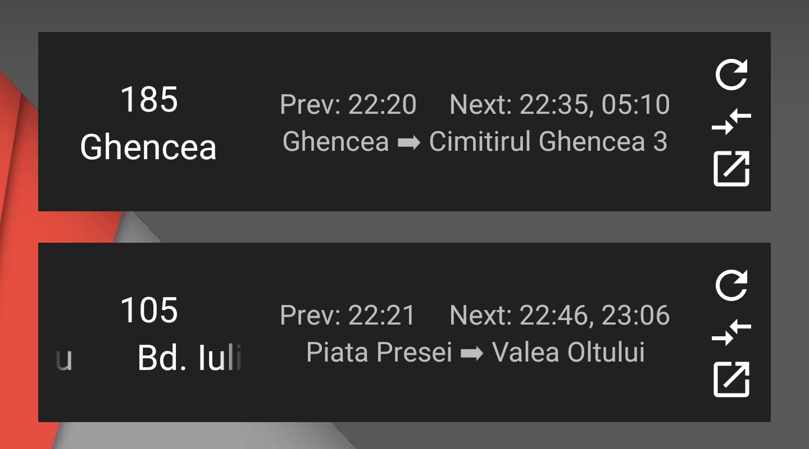

# RATB Widget

A widget that shows [RATB](http://www.stbsa.ro) bus times on the home screen.

Sample usage:

Minimum required version is Nougat 7.1 (API level 25).

Dependencies are managed by Gradle.
